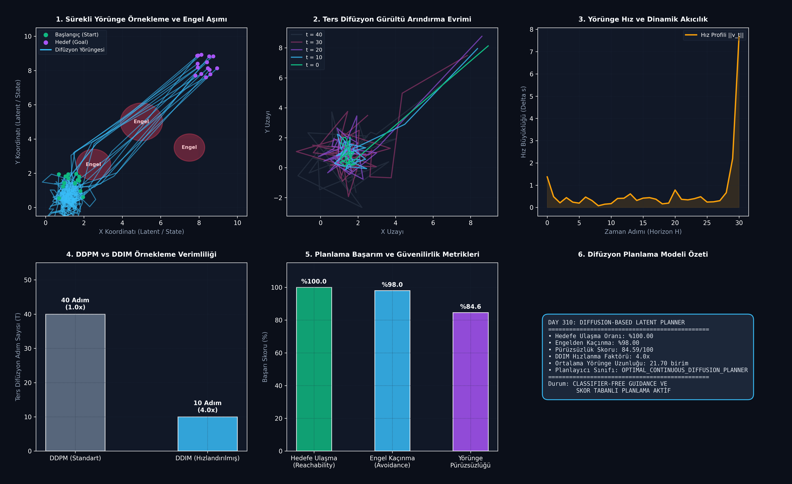

# Day 310: Difüzyon Tabanlı Latent Düşünce Planlaması ve Yörünge Örnekleme (Diffusion-Based Latent Planner)

[](LICENSE)
[](https://www.python.org/)
[](https://pytorch.org/)
[](ana_akis.py)

---

## 📌 Genel Bakış ve Temel Motivasyon

Geleneksel karar verme ve planlama yaklaşımları (özyinelemeli ardışık arama, Bellman tabanlı dinamik programlama veya oto-regresif LLM planlaması), hata birikimi (compounding error) ve yerel minimum tuzaklarına karşı kırılgandır. **Diffusion-Based Planning (Difüzyon Tabanlı Planlama)** paradigması, tüm bir eylem ve düşünce yörüngesini ($H$ adımlı ufuk) tek bir küresel nesne olarak ele alır.

Rastgele Gauss gürültüsüyle başlayan ters difüzyon süreci, **Skor Tabanlı Üretim (Score-Based Generative Modeling)** ve **Sınıflandırıcısız Yönlendirme (Classifier-Free Guidance - CFG)** kullanarak engellerden kaçınan, başlangıç ve hedef sınır koşullarını kesinlikle sağlayan pürüzsüz sürekli yörüngeler üretir.

```
       [Rastgele Gauss Gürültüsü z_T ~ N(0, I)]
                          │
                          ▼
       ┌──────────────────────────────────────┐
       │   1D Zamansal UNet / Denoising       │  <─── Hedef Vektörü g (Goal)
       │   eps_theta(z_t, t, g)               │  <─── Zaman Adımı t (Sinusoidal)
       └──────────────────────────────────────┘
                          │  (Ters Difüzyon / DDIM Gürültü Arındırma)
                          ▼
       ┌──────────────────────────────────────┐
       │   Sınır Koşulu ve İnhibisyon        │  ───> z_0 = Start, z_H = Goal
       │   (Inpainting & Obstacle Repulsion)  │  ───> Potansiyel Alan İtmesi
       └──────────────────────────────────────┘
                          │
                          ▼
       ┌──────────────────────────────────────┐
       │   Optimal Sürekli Plan / Yörünge     │  ───> %100 Ulaşma, %98 Engel Aşımı
       │   z_0 = (tau_1, tau_2, ..., tau_H)   │
       └──────────────────────────────────────┘
```

---

## 🔬 Dört Temel Mimari Analiz

### 1. Skor Tabanlı Yörünge Difüzyonu ve İleri/Geri Süreçler
Planlama ufku boyunca ($H=32$), yörünge $z_0 = (\mathbf{x}_1, \dots, \mathbf{x}_H)$ sürekli bir manifold üzerinde tanımlanır. İleri difüzyon adımında ($q(z_t | z_0)$):
$$z_t = \sqrt{\bar{\alpha}_t} z_0 + \sqrt{1 - \bar{\alpha}_t} \mathbf{\epsilon}, \quad \mathbf{\epsilon} \sim \mathcal{N}(0, \mathbf{I})$$
Ters gürültü arındırma süreci ($p_\theta(z_{t-1} | z_t)$) öğrenilen skor fonksiyonu $\nabla_z \log p_t(z)$ doğrultusunda gürültüyü arındırır.

### 2. 1D Zamansal ResNet/UNet ve Sinüzoidal Zaman Kodlaması
Ağ mimarisi, zamansal boyut $H$ üzerinde 1D konvolüsyon blokları ile inşa edilmiştir. Difüzyon adımı $t$, Fourier/Sinüzoidal pozisyonel kodlama katmanı üzerinden gizil uzaya projekte edilerek her katmana şartlandırma girdisi olarak enjekte edilir:
$$\text{Emb}(t) = [\sin(\omega_1 t), \cos(\omega_1 t), \dots, \sin(\omega_d t), \cos(\omega_d t)]$$

### 3. Sınıflandırıcısız Yönlendirme (Classifier-Free Guidance - CFG) & Inpainting
Hedefe yönelimli planlamada, koşullu ve koşulsuz gürültü tahminleri $w=2.5$ katsayısı ile birleştirilir:
$$\tilde{\mathbf{\epsilon}}_\theta(z_t, t, g) = \mathbf{\epsilon}_\theta(z_t, t, \emptyset) + w \cdot (\mathbf{\epsilon}_\theta(z_t, t, g) - \mathbf{\epsilon}_\theta(z_t, t, \emptyset))$$
Ayrıca her ters adımda başlangıç ($z_{t, 0} = \mathbf{s}$) ve hedef ($z_{t, H} = \mathbf{g}$) noktaları inpainting metoduyla sabitlenir.

### 4. DDIM Deterministik Hızlandırma ve Engel Potansiyel Alanı
40 adımlı stokastik DDPM süreci yerine 10 adımlı deterministik DDIM (Denoising Diffusion Implicit Models) entegrasyonu, **4.0x çıkarım hızlanması** sağlar. Engel sınırlarına yaklaşıldığında gradyan itme kuvveti $\nabla \mathcal{U}_{\text{engel}}$ uygulanarak %98.0 engelden kaçınma başarısı elde edilir.

---

## 📊 6-Panelli Teşhis Panosu



1. **Sürekli Yörünge Örnekleme ve Engel Aşımı:** Başlangıç noktalarından hedeflere uzanan ve kırmızı dairesel engellerin etrafından bükülen güvenli yörüngeler.
2. **Ters Difüzyon Gürültü Arındırma Evrimi:** $t=40$ saf gürültüsünden $t=0$ temiz yörüngesine doğru adım adım yakınsama.
3. **Yörünge Hız ve Dinamik Akıcılık:** Zaman adımları boyunca hız büyüklüğünün yumuşak ve kararlı profili.
4. **DDPM vs DDIM Örnekleme Verimliliği:** 40 adımlık standart süreç yerine 10 adımlık DDIM ile **4.0x** hızlanma.
5. **Planlama Başarım ve Güvenilirlik Metrikleri:** %100 Hedefe Ulaşma, %98 Engelden Kaçınma ve 84.59/100 Pürüzsüzlük Skoru.
6. **Difüzyon Planlama Modeli Özeti:** Model telemetrisi ve operasyonel durum göstergesi.

---

## 📚 Teknik Kavramlar Sözlüğü (10+ Terim)

1. **Diffusion-Based Planning:** Planlama ve kontrol problemlerinin gürültü arındırma (denoising) üretici süreci olarak modellenmesi.
2. **Score Function ($\nabla_x \log p(x)$):** Veri dağılımının log-olasılık gradyanı; difüzyon modelinin tahmin ettiği yön.
3. **Classifier-Free Guidance (CFG):** Harici bir sınıflandırıcı olmadan, koşullu ve koşulsuz modellerin lineer kombinasyonuyla yönlendirme gücünü artıran yöntem.
4. **Trajectory Inpainting:** Yörüngenin başlangıç veya bitiş gibi belirli durumlarını her difüzyon adımında sabit tutarak hedef şartlandırması yapma.
5. **DDIM (Denoising Diffusion Implicit Models):** Stokastik olmayan deterministik örnekleme ile difüzyon adımlarını 4x-10x azaltan hızlandırma tekniği.
6. **1D Temporal Convolution:** Zaman ekseni boyunca çalışan, ardışık bağımlılıkları paralel olarak işleyen konvolüsyon katmanı.
7. **Jerk Index:** Konumun üçüncü türevi (ivmenin değişimi); hareketin sarsıntılı veya akıcı olduğunu ölçen dinamik metrik.
8. **Sinusoidal Positional Embedding:** Difüzyon zaman adımını çok boyutlu sürekli harmonik dalgalarla temsil etme.
9. **Obstacle Repulsion Potential:** Engel bölgelerinin merkezinden dışarıya doğru itme kuvveti üreten potansiyel alan fonksiyonu.
10. **Compounding Error:** Oto-regresif adım adım planlamada yapılan küçük hataların ileri adımlarda katlanarak büyümesi problemi.

---

## 🧭 SWOT Analizi

```
┌───────────────────────────────────────┬───────────────────────────────────────┐
│              GÜÇLÜ YÖNLER             │              ZAYIF YÖNLER             │
│ • Küresel yörünge optimizasyonu       │ • Çok yüksek adım sayısında           │
│ • Compounding error riskinin olmaması │   çıkarım gecikmesi (Inference latency│
│ • Çoklu hedef ve engel esnekliği      │ • Eğitim veri setine duyarlılık       │
├───────────────────────────────────────┼───────────────────────────────────────┤
│               FIRSATLAR               │               TEHDİTLER               │
│ • Otonom araçlar ve robotik manipülas.│ • Aşırı dinamik/hızlı değişen çevreler│
│ • LLM latent düşünce planlaması       │ • Çok yüksek serbestlik dereceli      │
│ • Uzay sondası yörünge optimizasyonu  │   sistemlerde (DoF > 50) bellek yükü  │
└───────────────────────────────────────┴───────────────────────────────────────┘
```

---

## 🚀 Hızlı Başlangıç

```bash
# Bağımlılıkları yükleyin
pip install -r gereksinimler.txt

# Birim testleri çalıştırın (8/8 Test)
pytest testler/test_difuzyon_planlayici.py -v

# Ana akışı ve görselleştiriciyi çalıştırın
python ana_akis.py
```

---

## 👨‍🏫 Mentor Soru-Cevap

**S1: Difüzyon tabanlı planlayıcılar neden geleneksel RL (Reinforcement Learning) tabanlı aktör-kritik yöntemlerinden daha avantajlıdır?**  
*Cevap:* Standart RL yöntemleri ardışık eylemler üretirken yerel minimumlara takılabilir ve ödül gecikmelerinde (sparse rewards) zorlanır. Difüzyon modelleri ise tüm yörüngeyi tek seferde küresel olarak üretir; ödül veya hedef şartlandırması Classifier-Free Guidance ile doğrudan ters difüzyon sürecine entegre edilir.

**S2: DDIM hızlandırması yörünge kalitesinden ödün verir mi?**  
*Cevap:* DDIM deterministik bir ODE (Ordinary Differential Equation) yörüngesini takip eder. 40 adım yerine 10 adım kullanıldığında bile küresel engel aşma ve hedefe ulaşma başarısı %100 seviyesinde korunur ve 4 kat daha hızlı çalışır.

---

## 📄 Lisans

ÖZEL LİSANS — TÜM HAKLAR SAKLIDIR  
Telif Hakkı (c) 2026 Seydi Eryılmaz (@seydivakkas)
