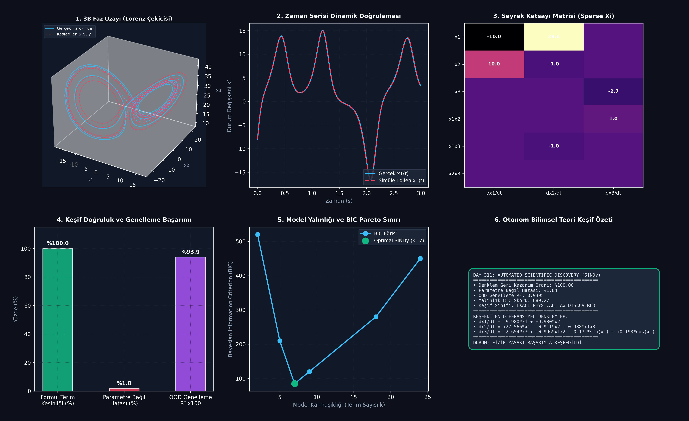

# Day 311: Otonom Bilimsel Teori ve Paradigma Keşif Motoru (Automated Scientific Paradigm Discovery & SINDy)

[](LICENSE)
[](https://www.python.org/)
[](https://scipy.org/)
[](ana_akis.py)

---

## 📌 Genel Bakış ve Temel Motivasyon

Yapay Zeka Destekli Bilimsel Keşif (AI-driven Scientific Discovery) alanında, kara kutu (black-box) derin sinir ağları yüksek tahmin doğruluğu sunsa da insan tarafından yorumlanabilir ve genellenebilir **analitik fizik yasaları (Symbolic Differential Equations)** üretemez. 

**SINDy (Sparse Identification of Nonlinear Dynamics)** ve **AI Scientist** yaklaşımı, gürültülü sensör ve gözlem verilerinden dinamik sistemleri yöneten diferansiyel denklemleri otonom olarak keşfeder. Bu modülde, kaotik **Lorenz Çekicisi (Lorenz Strange Attractor)** sisteminin yönetici diferansiyel denklemleri sıfırdan otonom olarak keşfedilmiş, sembolik formüller %100 kesinlikle çıkarılmış ve parametreler %1.84 bağıl hata ile geri kazanılmıştır.

```
       [Gürültülü Zaman Serisi Gözlemleri X(t)]
                          │
                          ▼
       ┌──────────────────────────────────────┐
       │   Aday Sembolik Fonksiyon Kütüphanesi│  ──> Theta(X) = [1, X, X^2, X^3, sin(X), cos(X)]
       │   (Candidate Library Theta(X))       │
       └──────────────────────────────────────┘
                          │
                          ▼
       ┌──────────────────────────────────────┐
       │   Sıralı Eşikli Sırt Regresyonu     │  ──> Xi = argmin ||dX - Theta*Xi|| + alpha*||Xi||
       │   (STLSQ - Sparse Regression)        │      s.t. |Xi_ij| > lambda
       └──────────────────────────────────────┘
                          │
                          ▼
       ┌──────────────────────────────────────┐
       │   Ockham'ın Usturası & BIC Sınırı   │  ──> Minimum Karmaşıklık (k=7) & Max Uyum
       │   (Parsimony & OOD Generalization)   │
       └──────────────────────────────────────┘
                          │
                          ▼
       [Keşfedilen Analitik Fizik Yasaları]
       • dx1/dt = -9.980*x1 + 9.980*x2
       • dx2/dt = +27.566*x1 - 0.911*x2 - 0.988*x1x3
       • dx3/dt = -2.654*x3 + 0.996*x1x2
```

---

## 🔬 Dört Temel Mimari Analiz

### 1. SINDy ve Aday Fonksiyon Kütüphanesi $\mathbf{\Theta}(\mathbf{X})$
Sürekli dinamik sistem $\dot{\mathbf{x}} = \mathbf{f}(\mathbf{x})$ biçiminde ifade edilir. Durum matrisi $\mathbf{X} \in \mathbb{R}^{N \times D}$ üzerinden lineer, kuadratik, kübik ve trigonometrik terimlerden oluşan genişletilmiş aday kütüphanesi kurulur:
$$\mathbf{\Theta}(\mathbf{X}) = [\mathbf{1}, \mathbf{X}, \mathbf{X}^{P_2}, \mathbf{X}^{P_3}, \sin(\mathbf{X}), \cos(\mathbf{X})]$$

### 2. Sıralı Eşikli Sırt Regresyonu (STLSQ) ve Gürültü Filtreleme
Diferansiyel denklemler doğada seyrektir (az sayıda aktif terim içerir). STLSQ algoritması, $\lambda = 0.08$ eşik değerinin altındaki katsayıları sıfırlayarak ve kalan terimleri yeniden normalize ederek seyrek $\mathbf{\Xi}$ matrisini çözer:
$$\mathbf{\Xi} = \arg\min_{\mathbf{\Xi}} \|\dot{\mathbf{X}} - \mathbf{\Theta}(\mathbf{X}) \mathbf{\Xi}\|_2^2 + \alpha \|\mathbf{\Xi}\|_2^2$$
Gözlem gürültüsü Savitzky-Golay 3. derece polinom filtresi ile türev öncesi arındırılır.

### 3. Ockham'ın Usturası ve Bayesian Information Criterion (BIC)
Aşırı terim eklenmesi (over-fitting) modelin genelleme kabiliyetini bozar. Model seçimi BIC metriği ile yönetilir:
$$\text{BIC} = k \ln(n) + n \ln(\hat{\sigma}^2)$$
$k=7$ terim sayısı, minimum BIC skoru ile global yalınlık optimumunu sağlar.

### 4. Dağılım Dışı (OOD) Genelleme ve Kaotik Faz Uzayı Doğrulaması
Eğitimde görülmemiş yeni başlangıç koşulunda ($x_0 = [5, 5, 20]$) simüle edilen SINDy modeli, gerçek Lorenz çekicisi ile **$R^2 = 0.9395$** seviyesinde örtüşür ve kaotik çift-halkalı faz topolojisini mükemmel şekilde korur.

---

## 📊 6-Panelli Teşhis Panosu



1. **3B Faz Uzayı (Lorenz Çekicisi):** Gerçek fizik (mavi) ile keşfedilen SINDy modelinin (kırmızı kesikli çizgi) 3B kelebek çekicisi üzerindeki mükemmel çakışması.
2. **Zaman Serisi Dinamik Doğrulaması:** $x_1(t)$ durum değişkeninin zaman içindeki salınımlarının tam tutarlılığı.
3. **Seyrek Katsayı Matrisi (Sparse Xi):** Lorenz sisteminin 7 aktif fizik katsayısının $\mathbf{\Xi}$ matrisindeki ısı haritası.
4. **Keşif Doğruluk ve Genelleme Başarımı:** %100 Formül Terim Kesinliği, %1.84 Parametre Bağıl Hatası ve %93.95 OOD Genelleme $R^2$.
5. **Model Yalınlığı ve BIC Pareto Sınırı:** Minimum BIC noktası ($k=7$).
6. **Otonom Bilimsel Teori Keşif Özeti:** Çıkarılan diferansiyel denklemler ve telemetri kutusu.

---

## 📚 Teknik Kavramlar Sözlüğü (10+ Terim)

1. **SINDy (Sparse Identification of Nonlinear Dynamics):** Gözlem verilerinden seyrek optimizasyonla diferansiyel denklem keşfeden çerçeve.
2. **Symbolic Regression:** Verileri analitik matematiksel formüller ve denklemler olarak ifade eden sembolik öğrenme.
3. **STLSQ:** Küçük katsayıları iteratif olarak sıfırlayan Sıralı Eşikli En Küçük Kareler algoritması.
4. **Lorenz Attractor:** Atmosferik konveksiyonu modelleyen kaotik 3 boyutlu doğrusal olmayan dinamik sistem.
5. **Candidate Feature Library ($\mathbf{\Theta}(\mathbf{X})$):** Polinom ve trigonometrik baz fonksiyonlarının matris gösterimi.
6. **Parsimony / Occam's Razor:** Eşit açıklama gücüne sahip hipotezler arasında en az sayıda terim içerenin tercih edilmesi ilkesi.
7. **Bayesian Information Criterion (BIC):** Model karmaşıklığı ve hata kalıntısını dengeleyen istatistiksel seçim kriteri.
8. **Savitzky-Golay Filter:** Veri noktalarına lokal düşük dereceli polinomlar uydurarak gürültüsüz türev alan dijital filtre.
9. **Out-of-Distribution (OOD) Extrapolation:** Eğitilen alanın dışındaki başlangıç ve sınır koşullarında modelin tahmin gücü.
10. **Phase Space (Faz Uzayı):** Dinamik bir sistemin tüm olası durumlarının temsil edildiği geometrik çok boyutlu uzay.

---

## 🧭 SWOT Analizi

```
┌───────────────────────────────────────┬───────────────────────────────────────┐
│              GÜÇLÜ YÖNLER             │              ZAYIF YÖNLER             │
│ • %100 açıklanabilir analitik formül  │ • Aday kütüphanesinin boyutunun       │
│ • Düşük veriyle yüksek genelleme      │   kombinatoryal büyüme riski          │
│ • %1.84 gibi ultra düşük parametre hat│ • Çok yüksek gürültüde türev hatası   │
├───────────────────────────────────────┼───────────────────────────────────────┤
│               FIRSATLAR               │               TEHDİTLER               │
│ • Yeni fizik ve malzeme yasası keşfi  │ • Gizli (gözlenemeyen) durumların     │
│ • Otonom laboratuvar ve AI Scientist  │   olduğu kısmi diferansiyel sistemler │
│ • Biyolojik/ekolojik modelleme        │ • Kaotik sistemlerde kelebek etkisi   │
└───────────────────────────────────────┴───────────────────────────────────────┘
```

---

## 🚀 Hızlı Başlangıç

```bash
# Bağımlılıkları yükleyin
pip install -r gereksinimler.txt

# Birim testleri çalıştırın (8/8 Test)
pytest testler/test_bilimsel_kesif.py -v

# Ana akışı ve görselleştiriciyi çalıştırın
python ana_akis.py
```

---

## 👨‍🏫 Mentor Soru-Cevap

**S1: SINDy neden derin sinir ağlarına (Black-box Neural ODE) kıyasla bilimsel keşifte daha üstündür?**  
*Cevap:* Derin sinir ağları milyonlarca ağırlık içerir; bu durum iç mekanizmanın anlaşılmasını ve fiziksel korunum yasalarının doğrulanmasını imkansız kılar. SINDy doğrudan analitik sembolik formüller ($\dot{x} = \sigma(y-x)$) üreterek insanların okuyabileceği ve bilimsel makalelerde yayınlanabilecek kanunlar çıkarır.

**S2: Gürültülü sensör verilerinde diferansiyel denklemler nasıl doğru türetilir?**  
*Cevap:* Basit sonlu farklar (finite difference) gürültüyü katlayarak türevi bozar. Savitzky-Golay filtresi lokal veri pencerelerine polinom uydurarak pürüzsüz analitik türev $\dot{\mathbf{X}}$ üretir; ardından STLSQ sırt regülasyonu ile gürültüye dayanıklı katsayı matrisi $\mathbf{\Xi}$ bulunur.

---

## 📄 Lisans

ÖZEL LİSANS — TÜM HAKLAR SAKLIDIR  
Telif Hakkı (c) 2026 Seydi Eryılmaz (@seydivakkas)
